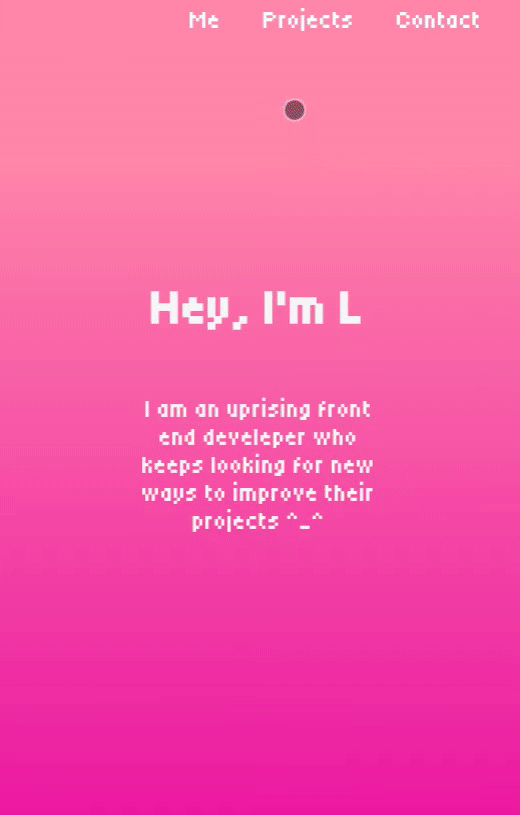

My personal portfolio website — the final project for FreeCodeCamp's Responsive Web Design certification. Built in 2024 to showcase my first projects and mark the completion of this learning journey.

The project only consists of **HTML** + **CSS** and was made as a part of FreeCodeCamp's Responsive Web Design course.

---
## 📋 Project Requirements

This project fulfills all **11 user stories** from FreeCodeCamp's "Build a Personal Portfolio" challenge:

<b>Click to expand the full requirements</b>

 

**User Stories:**
- [x] Welcome section with `id="welcome-section"`
- [x] `h1` element inside `#welcome-section` containing text
- [x] Projects section with `id="project-section"`
- [x] At least one element with `class="project-tile"` inside projects section
- [x] At least one link to a project inside the projects section
- [x] Navbar with `id="navbar"`
- [x] At least one clickable link in navbar that navigates to different sections
- [x] Link with `id="profile-link"` that opens GitHub/freeCodeCamp profile in a new tab (`target="_blank"`)
- [x] At least **1** media query for responsive design
- [x] Welcome section height = viewport height (`100vh`)
- [x] Navbar is **always at the top** of the viewport (fixed/sticky)

**All tests passed** ✅

---

## 🎨 About the Project

After four projects of learning forms, tributes, documentation, and landing pages — this was the moment to put it all together. A portfolio to showcase everything I had built up to that point. Even right now I have fond memories of it. I like how simple and at the same time stylish it is. And it is somehow responsive.

I remember being particularly proud of:
- The **full-viewport welcome section** with its background
- Making the navbar stay fixed without covering content
- My first real attempt at a responsive grid for projects
- Finally understanding `vh` units and why they matter

Also I changed the original project links to the new github repos! The images were already local for the project so i only changed the paths for gh pages.

Looking at it now, I can see the rookie decisions — but that's exactly why I wanted to preserve it. This is where I started.

| **Personal Portfolio Webpage Preview on PC** |
|---|
|  |

| **Personal Portfolio Webpage Preview on Mobile** |
|---|
|  |

<i>submitted to FreeCodeCamp on Oct 30, 2024</i>

---

## 🔗 Live Demo

---

| My official [FreeCodeCamp Responsive Web Design Certificate](https://www.freecodecamp.org/certification/fcc058fd235-9bca-44b6-b085-10ee4a9bdda6/responsive-web-design) |
|---|
|  |
